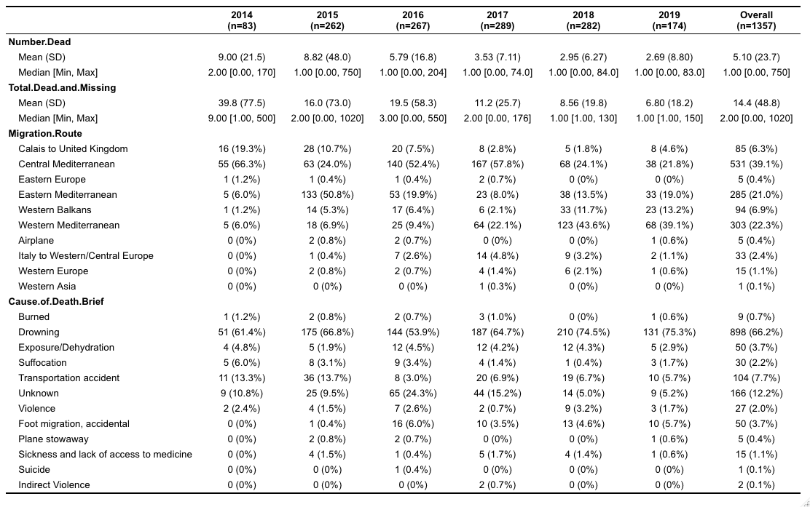
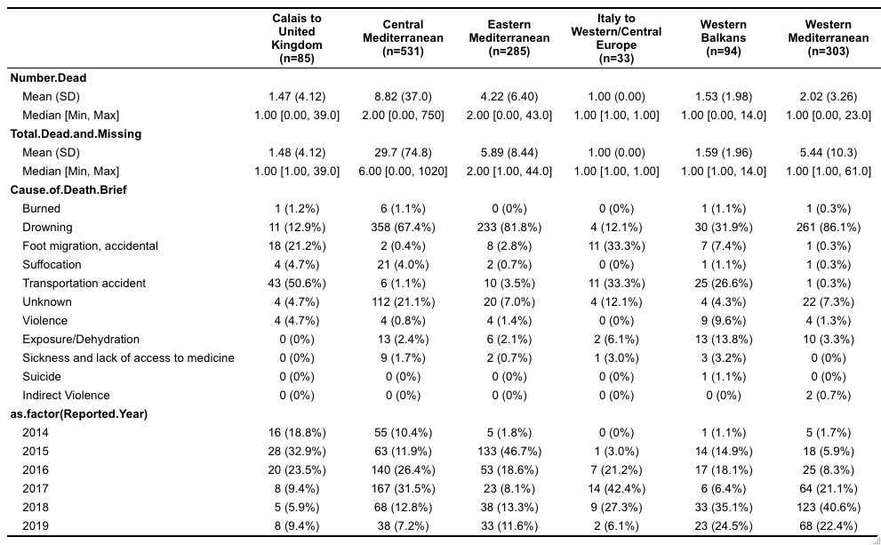
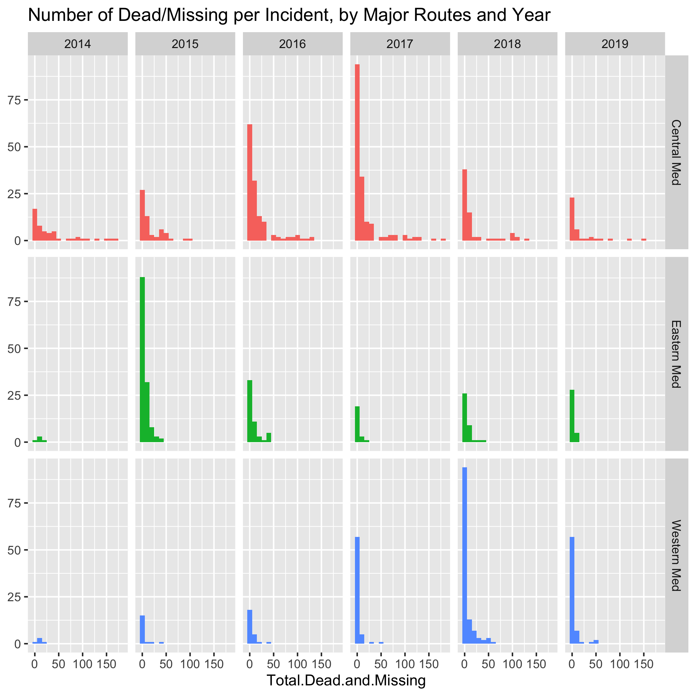
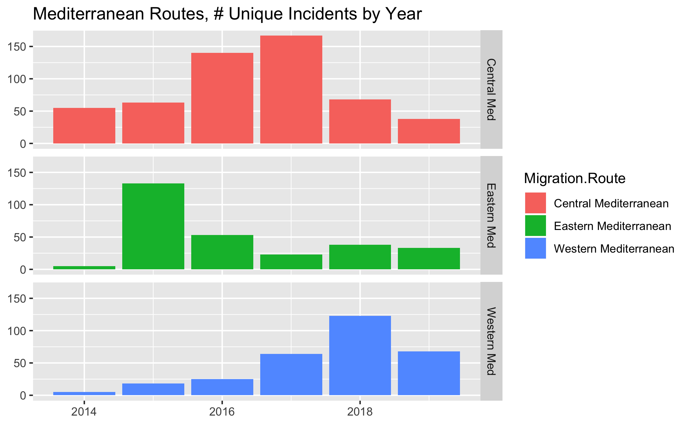
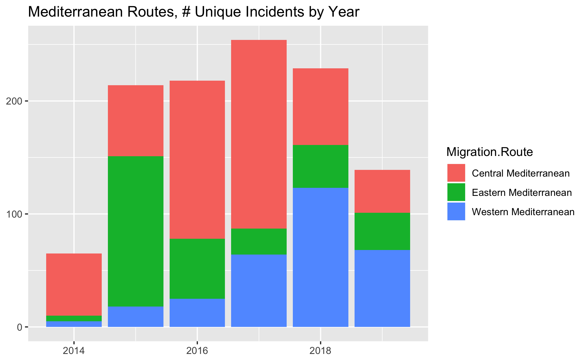

# Visualizations - Dead & Missing, absolute values  

## Tables
To get a sense of the distribution

### By Year
The number dead, total dead and missing, incidents per migration route, and cause of death

### By Route
The number dead, total dead and missing, cause of death, and year

## Plots

Note how the number of unique incidents, defined as an incident where someone was killed or went missing at sea while crossing the Mediterranean routes, are nearly stable since 2015. This is despite tightening of border controls shifting migration from Greece to Italy to Spain. Border enforcement efforts appear to be a veritable whack-a-mole

