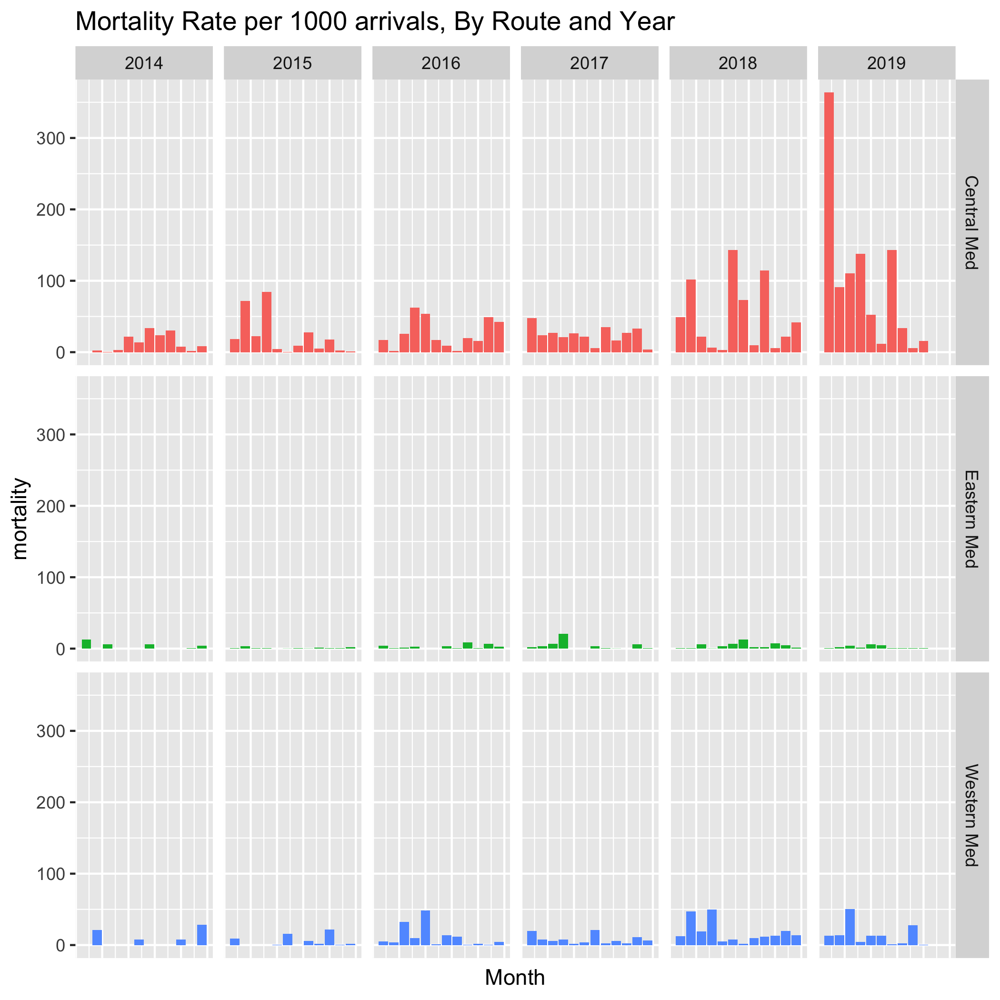
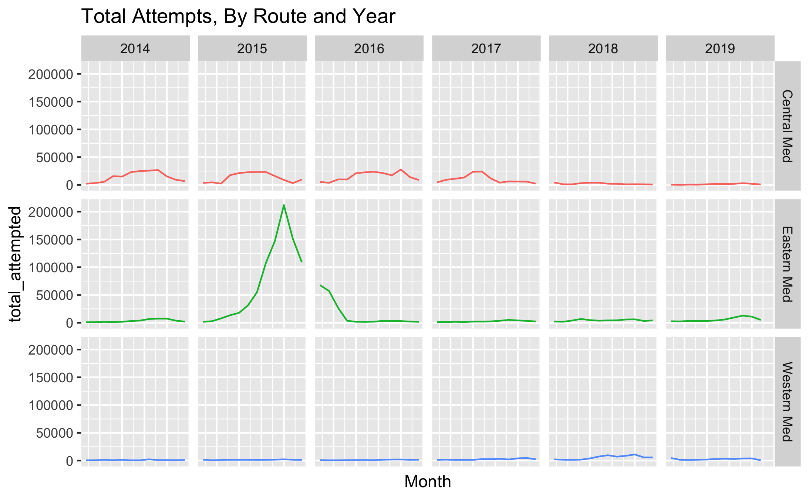
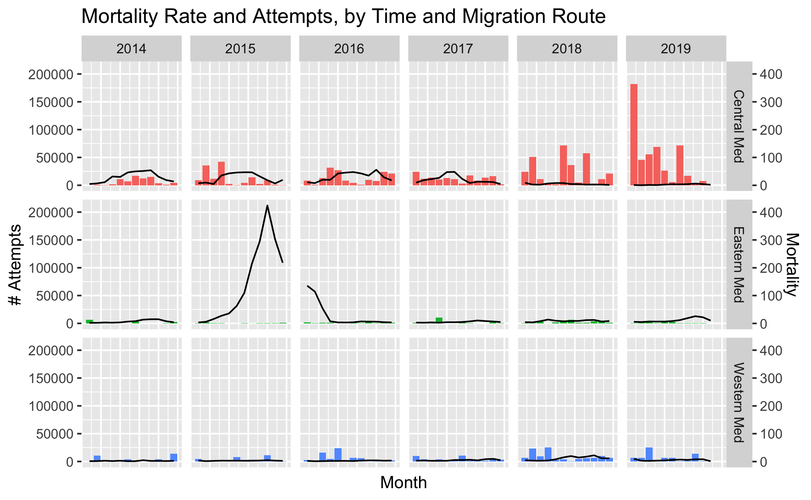
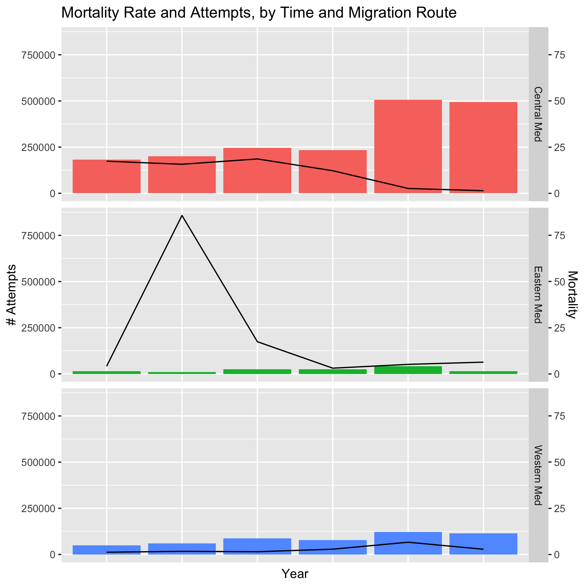
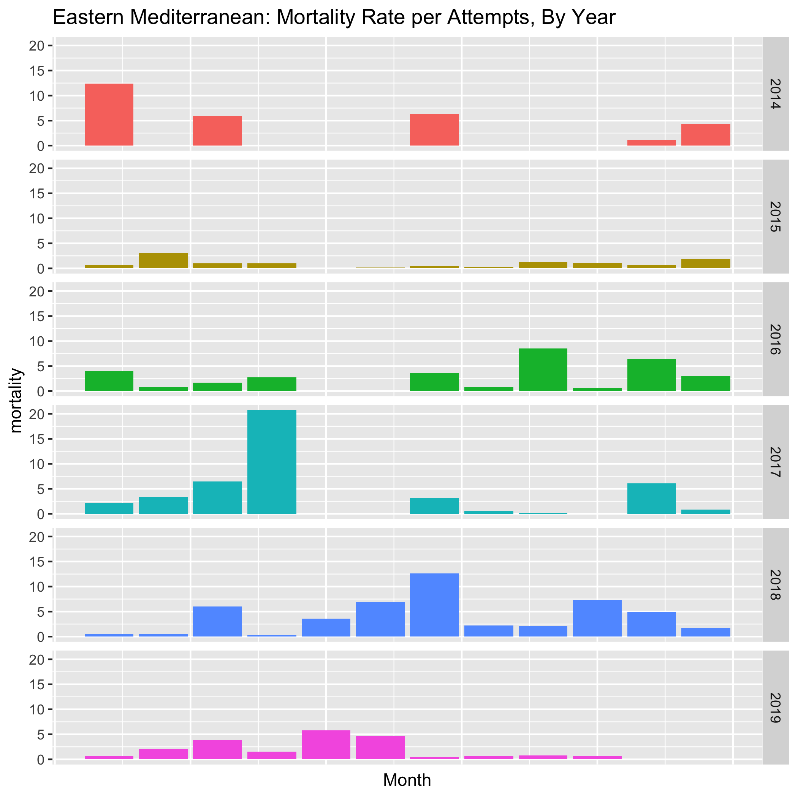
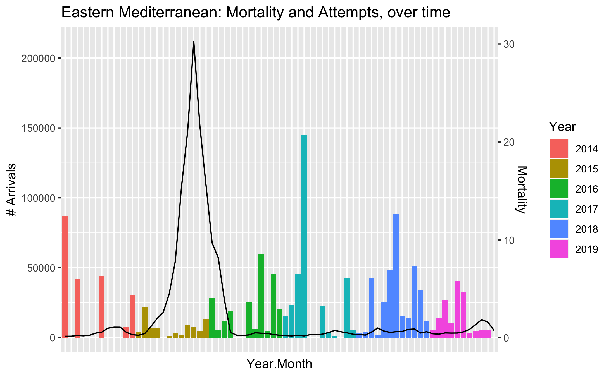
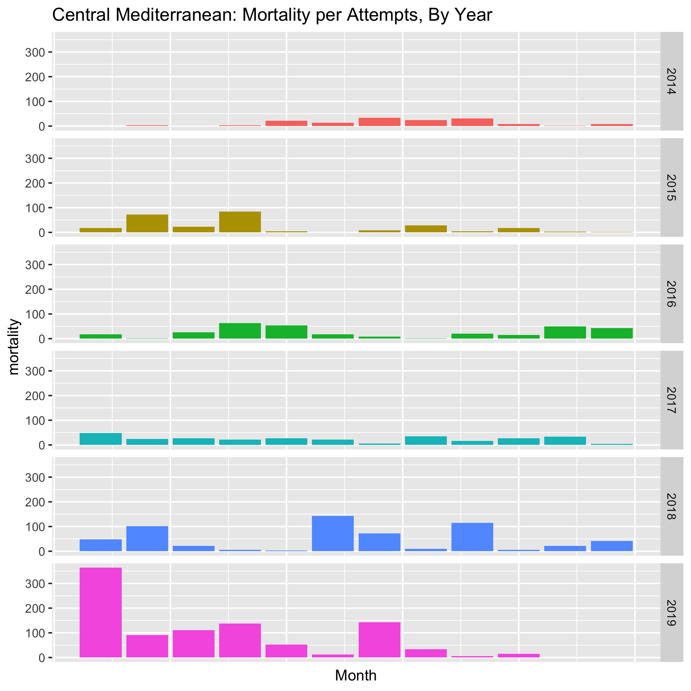
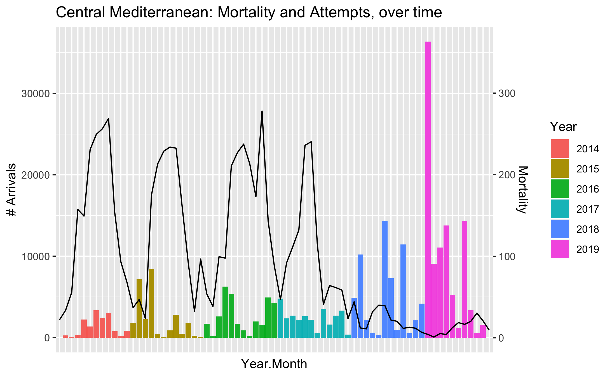
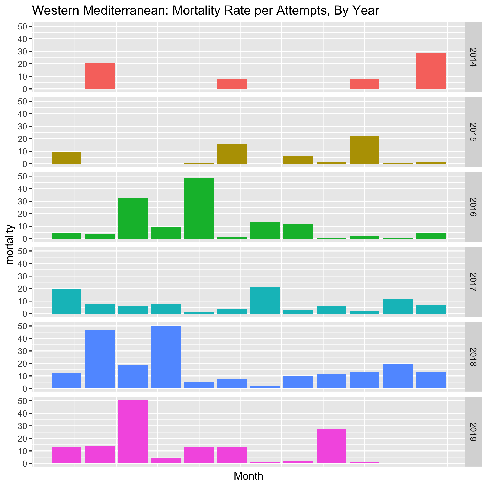
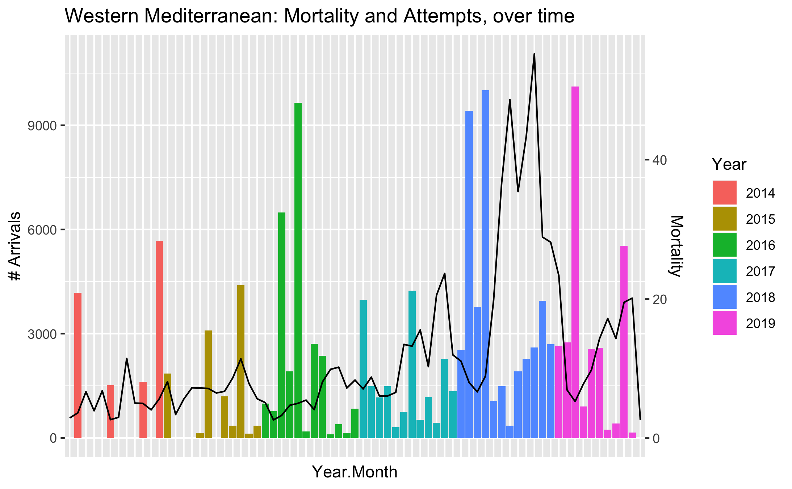

# Visualization - Mortality

## Combined Routes, Monthly Data

The mortality rate is significantly higher for the Central Mediterranean route, which is to be expected because the distance for the journey is much longer and more treacherous. 

What is not to be expected, however, is that the mortality rate increases dramatically increases over time. In January of 2019, 36% of the people who attempted to cross via the Central route died or went missing in the Mediterranean

The number of people who attempted to cross per route peaked dramatically in Greece in late 2015/early 2016. While this peak drowns out the relative changes in the other routes, note that Central attempted crossings decreased after 2017

## Combined Routes, Yearly Data

When visualized by year, it is clear that the mortality rate per attempted crossing has a inverse relationship with the amount of attempted crossings in the Eastern and Central routes

## Eastern Mediterranean Route: Greece and Cyprus

When compared, there are not significant patterns by month (ex: Aprils do not have higher mortality from year to year). This implies that the changes in mortality are due to external social factors, rather than weather patterns. 

## Central Mediterranean Route: Italy and Malta

Like the Eastern route, the Central route doesn't have noticable patterns that would indicate weather effects. 

Mortality rates appear to have a negative correlation with the number of attempts to cross the Central route. Given that the number of crossings haev been diminished by border control efforts, this has significant implications. 

## Western Mediterranean Route: Spain

